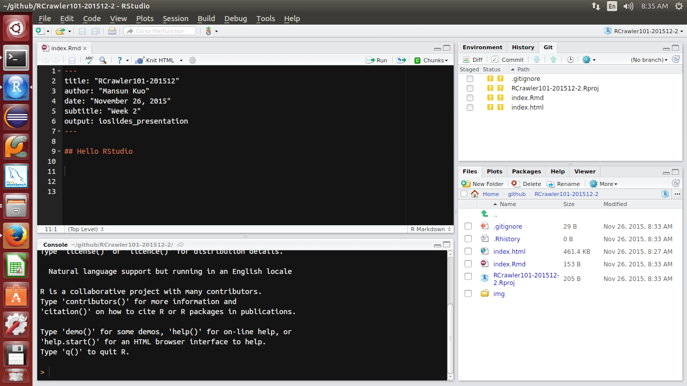
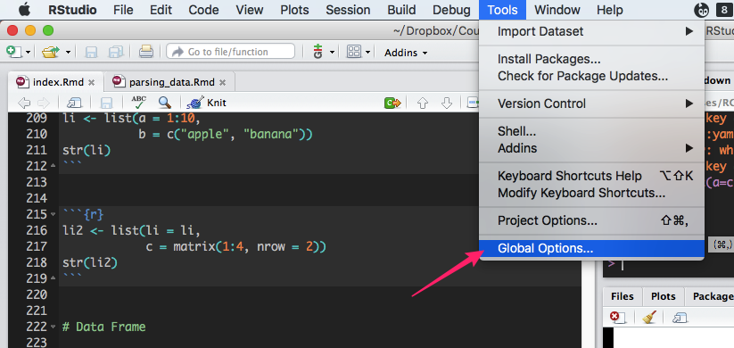
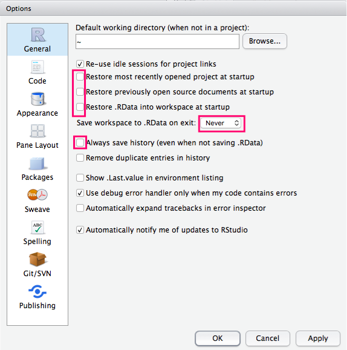
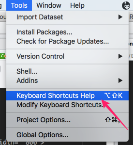
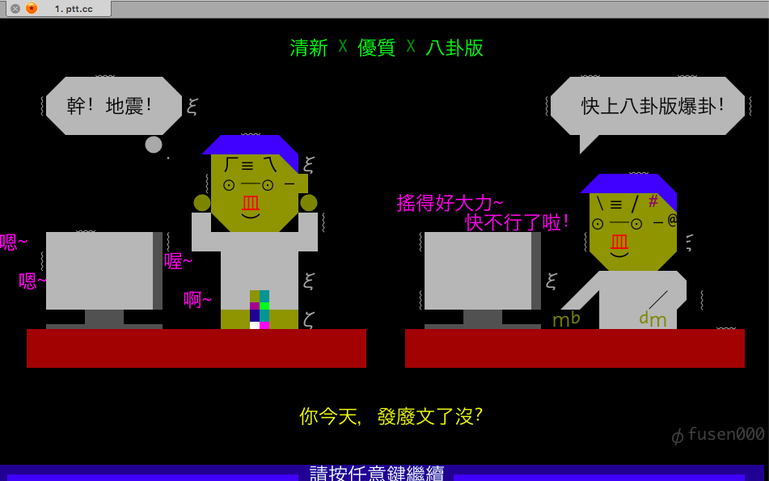
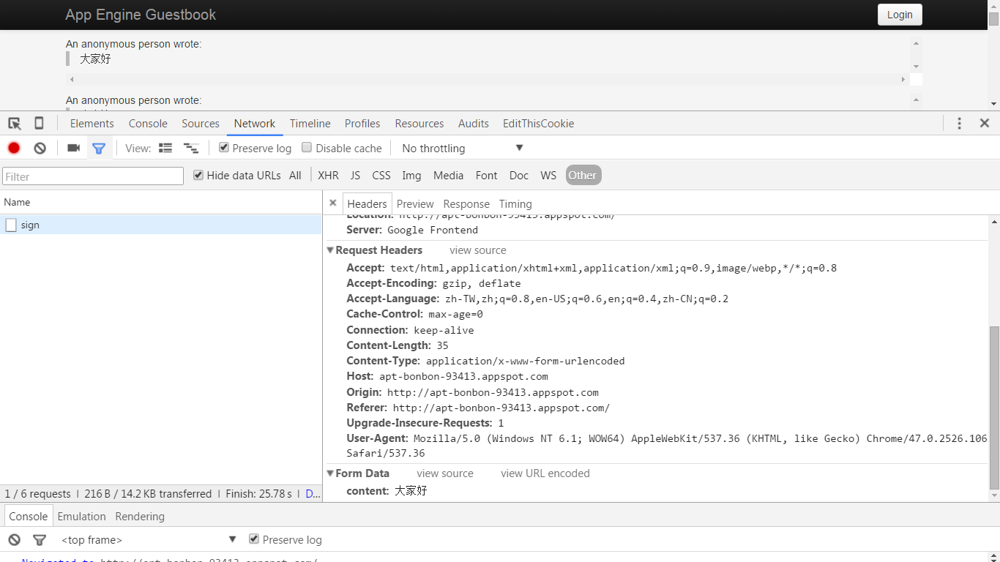
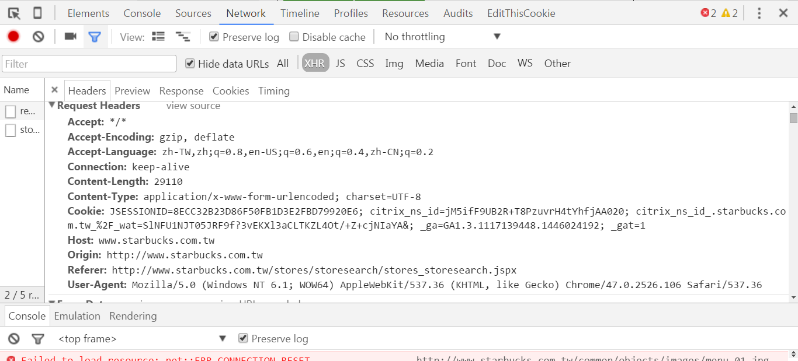

```{r, include=FALSE}
library(knitr)
knitr::opts_chunk$set(warning = TRUE,
                      echo = TRUE,
                      message = TRUE,
                      collapse = FALSE,
                      comment = "#>",
                      fig.align='center',
                      cache=FALSE)
# knitr::opts_knit$set(root.dir = '.')
```

# <br/><br/>RCrawler101-201605 (Week2) {.white}


<p class="white">
`r Sys.Date()`<br/>
<p style='color:white'>
  Leo Lu  
  [Github](https://github.com/leoluyi)  
  [LinkedIn](https://tw.linkedin.com/in/leoluyi)
</p>
</p>

# Outline

+ Recap for observation skills (10 min)
+ R Basic (quick recap) and RStudio IDE (10 min)
+ Connection
    - Crawler’s toolkits in R
+ Parsing Data (50 min)
    + XPath & CSS
    + json
    + xml
    + html table
    + regex
+ Save your data (10 min)
+ Case study
+ References


# Install: Chrome Extension

+ [EditThisCookie](https://chrome.google.com/webstore/detail/editthiscookie/fngmhnnpilhplaeedifhccceomclgfbg?hl=zh-TW)
+ [XPath Helper](https://chrome.google.com/webstore/detail/xpath-helper/hgimnogjllphhhkhlmebbmlgjoejdpjl?hl=zh-TW)
+ [JSON Viewer](https://chrome.google.com/webstore/detail/json-viewer/gbmdgpbipfallnflgajpaliibnhdgobh)


# Recap Observation Skills and HTTP request for Connection

+ URL, Method, GET, POST, Headers, Body
+ Excample: [PTT Gossiping](https://www.ptt.cc/bbs/Gossiping/)


# R Packages Required

## Pipeline Coding
- [magrittr](https://github.com/smbache/magrittr)

## Crawler's toolkits in R
- [rvest](https://cran.r-project.org/web/packages/rvest/index.html): a web scraper based on httr and xml2
- [httr](https://cran.r-project.org/web/packages/httr/index.html): toolkit of  [HTTP methods](http://www.w3schools.com/tags/ref_httpmethods.asp) in R
- [XML](https://cran.r-project.org/web/packages/XML/index.html) & : XML parser
- [xml2](https://cran.r-project.org/web/packages/xml2/index.html): xml parser based on libxml2

## misc
- [stringr](): string manipulaiton
- [data.table](https://github.com/Rdatatable/data.table): extension of data.frame, a powerful ETL tool in R


# Install Packages

## (if you haven't those packages yet)

```{r, eval=FALSE}
## === install required packages ===
pkg_list <- c("magrittr", "httr", "rvest", "stringr", "data.table", "jsonlite", "RSQLite")
pkg_new <- pkg_list[!(pkg_list %in% installed.packages()[,"Package"])]
if(length(pkg_new)) install.packages(pkg_new)
rm(pkg_new, pkg_list)
```

---

## Let's Rock with R! { .shout .shrink }

---

# Hello RStudio



# RStudio Settings




</p>

# Must-known keyboard shortcuts

[All RStudio keyboard shortcuts](https://support.rstudio.com/hc/en-us/articles/200711853-Keyboard-Shortcuts)

<div style="font-size: 80%">
| Description      |  Windows & Linux      |     Mac                 |
|------------------|:---------------------:|:-----------------------:|
| Attempt completion / Indent | <kbd>Tab</kbd>     | <kbd>Tab</kbd>  |
| Run current line/selection  | <kbd>Ctrl</kbd>+<kbd>Enter</kbd> | <kbd>⌘</kbd>+<kbd>↩︎</kbd> |
| Comment/uncomment current line/selection | <kbd>Ctrl</kbd>+<kbd>Shift</kbd>+<kbd>C</kbd> | <kbd>⌘</kbd>+<kbd>⇧</kbd>+<kbd>C</kbd> |
| Reindent lines              | <kbd>Ctrl</kbd>+<kbd>I</kbd> | <kbd>⌘</kbd>+<kbd>I</kbd> |
| Insert pipe operator | <kbd>Ctrl</kbd>+<kbd>Shift</kbd>+<kbd>M</kbd> | <kbd>⌘</kbd>+<kbd>⇧</kbd>+<kbd>M</kbd>
</div>



# R recap

- How to get help
- Working Environment
- Basic Data Structure
- Function
- if/else, for, tryCache
- [magrittr](https://github.com/smbache/magrittr)
- [data.table](https://cran.r-project.org/web/packages/data.table/index.html)


# How to get help

- `?`: Access ducument in R console
- `??`: Search the halp system
- google with appropriate keyword. For example:
    - R {package name}
    - R {algorithm name}
- Forum
    - [Stack Overflow](http://stackoverflow.com/questions/tagged/r)  
      A question and answer site for programmers
    - [Taiwan R user Group](http://www.meetup.com/Taiwan-R/)  
      A free R/data analysis user group in Taiwan
    - [PTT R_Language board](https://www.ptt.cc/bbs/R_Language/index.html)  
      A bbs forum for R in Taiwan


# Working Environment

__Check your working directory everytime you start to work!__

Using `getwd`/`setwd` to get/set your working directory.

```{r working_dir, eval=FALSE}
wd = getwd()
setwd("resources/img")
getwd()
setwd(wd)
getwd()
```


RStudio will set working directory automatically when opening new files.

If you [using Projects](https://support.rstudio.com/hc/en-us/articles/200526207-Using-Projects),
RStudio will change working directory for you automatically.


# Basic Data Structure

`Vector`, `Matrix`, `Array`, `List` and `Data frame` are the most basic data structure in R.
These data structures can be mapped into a table according to:

- dimension
- Homogeneous or Heterogeneous of data type


|      | Homogeneous       | Heterogeneous  |
| ---- | ----------------- |--------------- |
| 1d   | _Atomic vector_   | _List_         |
| 2d   | Matrix            | Data frame     |
| nd   | Array             |              	|


# (Atomic) Vector

Vector is a basic data structure in R. 
Atomic vectors are linear vectors of a single primitive type.
A scalar is a vector of length 1.


```{r, collapse=TRUE}
v1 <- c(1:10)
v1
is.vector(v1)
length(v1)
s1 <- 2
s1
is.vector(s1)
length(s1)
```

# List

Lists are also vectors, but not _atomic vectors_. Lists are generic vectors, with (naturally) different semantics.

Elements in a list can be any kinds type and its length is arbitrary.
Function `str` can help you investigate the structure of a nested list.


```{r}
li <- list(a = 1:10, 
           b = c("apple", "banana"))
str(li)
```


```{r}
li2 <- list(li = li, 
            c = matrix(1:4, nrow = 2))
str(li2)
```


# Data Frame

Data frame is a 2-dimension data structure to deal with a table-like heterogeneous data.

```{r}
df <- data.frame(gender = c("male", "female", "female", "male"),
                 age = c(33, 18, 24, 26))
## Add new column in a data frame
df$city <- c("Taipei", "Taipei", "Hsinchu", "Taichung")
```

```{r}
df
str(df)
```


# Recap: data structure

All data structures above are objects.
They apply different methods and saved as different type internally.

```{r echo = FALSE}
x <- data.frame(object = c('c(1, 2.5, 3)', 
                           'c("male", "female", "female", "male")',
                           'factor(c("male", "female", "female", "male"))', 
                           'matrix(1:9, nrow = 3)',
                           'list(a = 1:10, b = c("apple", "banana"))',
                           'data.frame(a = 1, b = "z")'))
x$type <- sapply(parse(text = sprintf("typeof(%s)", x$object)), eval)
x$class <- sapply(parse(text = sprintf("class(%s)", x$object)), eval)
knitr::kable(x)
```


# Function 

To understand computations in R, two slogans are helpful:  

> Everything that exists is an object.  
> Everything that happens is a function call.  

**John Chambers**

<br/>

```{r, collapse=TRUE}
`+`
`<-`
`[`
`c`
```


# Function in R

A typical function in R may look like:

```{r}
f <- function(arg1, arg2, ...) {
    # Some magic happened
    return(sth)    # return something
}
```

- If you don't use `return` to specify the return value, 
  the return value will be the _last expression_ inside the function.
- Call by value by default  
    send a copy of a object into a function and the input object won't change after execution without assignment


# If

The basc structure of conditional execution in R is:

```{r, eval=FALSE}
if (an expression returns TRUE or FALSE) {
    # do something
} else if (another expression returns TRUE or FALSE) {
    # do something
} else {
    # do something
}
```


# for

Iterate items in R.

```{r}
# iterate a character vector
for (i in c("a", "b")) {
    print(i)
}

# nested loop
m <- matrix(numeric(), nrow = 2, ncol = 2)
for (i in 1:nrow(m)) {
    for (j in 1:ncol(m)) {
        m[i, j] <- i * j
    }
}
m
```


# tryCache

tryCache let you deal with error handling in R.

```{r, eval=FALSE}
tryCatch({
    result <- expr
}, warning = function(w) {
    # warning handling 
}, error = function(e) {
    # error handling 
}, finally {
    # finally
})
```


# magrittr


Pipe argument to right-hand side with `%>%`

```
- x %>% f is equivalent to f(x)
- x %>% f(y) is equivalent to f(x, y)
- x %>% f %>% g %>% h is equivalent to h(g(f(x)))
- x %>% f(y, .) is equivalent to f(y, x)
- x %>% f(y, z = .) is equivalent to f(y, z = x)
```

---
## Workflow of Crawler Design {.shout}
---

1. 找到資料頁，想像資料要長什麼樣子
2. 找到資料所在的request/response
3. 一層層往上解析


- 儘量把資料撈完整，才足夠轉換成資訊。
- 先設想產出的資料格式(schema)，觀察網頁內容，才知道database table如何設計。
- 先到要搜尋資料的詳細資料頁，解析資料，再一層層往上解析，套上判斷式及迴圈, 完成爬蟲的自動化。


# Crawler's toolkits in R

- [rvest](https://cran.r-project.org/web/packages/rvest/index.html): a web scraper based on httr and xml2
- [httr](https://cran.r-project.org/web/packages/httr/index.html): toolkit of  [HTTP methods](http://www.w3schools.com/tags/ref_httpmethods.asp) in R
- [XML](https://cran.r-project.org/web/packages/XML/index.html) & : XML parser
- [xml2](https://cran.r-project.org/web/packages/xml2/index.html): xml parser based on libxml2
- [RCurl](https://cran.r-project.org/web/packages/RCurl/index.html): a wrapper of libcurl


---
## Web Connector with R {.shout}
---

# HTTP request

A valid HTTP request includes four things:

- **URL**: a unique address for a thing
- **Method**:
    - GET: to retrieve a resource
    - POST: to create a new resource
- **Headers**: Meta-information about a request
    - User-Agent
    - Cookie
    - Content-type
    - [List of HTTP header fields](https://en.wikipedia.org/wiki/List_of_HTTP_header_fields)
- **Body**: data to be send to a server


# Web Connector in R
- `httr`
- `RCurl`
- `download.file()`
- Socket Connection Tools:
    - socketConnection
    - `make.socket` / `read.socket` / `close.socket`

# Connection: GET Method

Use `GET()` to request data from a specific resource

## 起手式

```{r, eval=FALSE}
## Not Run
library(httr)
library(rvest)
res <- GET(
  url = "http://httpbin.org/get",
  add_headers(a = 1, b = 2),
  set_cookies(c = 1, d = 2)
)
res_text <- content(res, as = "text", encoding = "UTF-8")
doc <- read_html(res_text, encoding = "UTF-8")
```


# 一個例子學會第一隻爬蟲

- PTT Gossiping

<a href="https://www.ptt.cc/bbs/Gossiping/index.html" target="_blank">

</a>


```{r}
library(magrittr)
library(httr)
library(rvest)
url <- "https://www.ptt.cc/bbs/Gossiping/index.html"
doc <- GET(url, 
           set_cookies('over18'='1')) %>%  # over18 cookie
  content(as = "text", encoding = "UTF-8") %>% 
  read_html

doc %>% 
    html_nodes(xpath = '//*[@id="action-bar-container"]/div/div[2]/a[2]') %>% 
    html_attr("href")
```

# httr

- Basic Features:
    - HTTP verbs: `GET()`, `POST()`, `HEAD()`... 
    - `http_status`: Translate http status code
       [HTTP status](https://zh.wikipedia.org/wiki/HTTP%E7%8A%B6%E6%80%81%E7%A0%81) code
    - `headers()`: Access response headers
    - `content()`: Retrieve the contents of a request
        - as = "parsed": detect content type automatically and parse the result
        - as = "text": return character
        - as = "raw": return binary
    - `set_cookies()`: set cookles
    - `add_headers()`: add additional headers to a request.

# httr basics

```{r, collapse=TRUE}
library(httr)
res <- GET(
  url = "http://httpbin.org/get",
  add_headers(a = 1, b = 2),
  set_cookies(c = 1, d = 2)
)

status_code(res)

headers(res)

res_text <- content(res, type = "text", encoding = "UTF-8")
```

<br/>
## The response

### The status code
```{r, collapse=TRUE}
res <- GET("http://httpbin.org/get")

# Get an informative description:
http_status(res)

# Or just access the raw code:
res$status_code

# highly recommend using one of these functions whenever you're using httr inside a function to make sure you find out about errors as soon as possible.
warn_for_status(res)
stop_for_status(res)
```

<br/>
### THe Body

3 ways to access the body of the request:

+ text
```{r, collapse=TRUE}
res <- GET("http://httpbin.org/get")
content(res, "text", encoding = "UTF-8")  # accesses the body as a character vector
```

+ binary
```{r, collapse=TRUE}
(bin <- content(res, "raw"))  # raw (binary) vector
# writeBin(bin, "myfile.txt") # the highest fidelity way of saving files to disk
```

+ auto parsed
httr provides a number of default parsers for common file types:  
html_document, csv, json, jpeg, png. See `?httr::content`
```{r, collapse=TRUE}
content(res, "parsed")
```


---

# Query String

You can assign query parameter with `query()` 

```{r}
res1 <- GET(
  "http://ecshweb.pchome.com.tw/search/v3.3/all/results?q=sony&page=1&sort=rnk/dc"
)

url2 <- "http://ecshweb.pchome.com.tw/search/v3.3/all/results"
res2 <- GET(url2,
           query = list(q="sony", page="1", sort="rnk/dc"))
identical(res1$content, res2$content)
```


# rvest

A web scraper designed to work with magrittr.

- Create a html document with `read_html()`
- Select parts of a document using css selectors or xpath
    - `html_nodes(doc, css = "<css selector>")`
    - `html_nodes(doc, xpath = "<css selector>")`
- Extract components with 
    - `html_name()`: the name of the tag
    - `html_text()`: all text inside the tag
    - `html_attr()`: contents of a single attribute
    - `html_attrs()`: all attributes
    - `html_table`: parse tables into data frames 


# A simple HTML document

[demo](resources/data/demo.html)

```{r}
library(magrittr)
doc = readLines("resources/data/demo.html") %>%
    paste(collapse = "\n")
cat(doc)
```


# Create HTML document 

```{r}
library(rvest)
doc = read_html("resources/data/demo.html")
doc
class(doc)
```

# Extract elements from HTML document

## Extract with css

CSS practice
http://flukeout.github.io/

```{r}
doc %>% 
    html_nodes(css = ".character") %>% 
    html_text
doc %>% 
    html_nodes(css = "#title > .link") %>% 
    html_text
```


# Extract with xpath

```{r}
doc %>% 
    html_nodes(xpath = "//*[@class='character']") %>% 
    html_text
doc %>% 
    html_nodes(xpath = "//div[@id='title']/a") %>% 
    html_text
```


# Extract name of tag

```{r}
node = doc %>% 
    html_nodes(css = "#summary") %>% 
    html_name
node
```


# Extract link

```{r}
link = doc %>% 
    html_nodes(xpath = "/html/body/div[@id='title']/a") %>%
    html_attr("href")
link
```


# Extract table

```{r}
students = doc %>% 
    html_nodes(xpath = "//table") %>%
    html_table()
students
```


# The secret of URL

```
URL?val1=val1&val2=val2
```

- The query string is sent in the URL of a
[GET](http://www.w3schools.com/tags/ref_httpmethods.asp) request
- Non-ASCII character and some preserved characters need to be encoded with 
[URL Encode](http://www.w3schools.com/tags/ref_urlencode.asp)
- In most situation, you may need to manipulate the query string when you 
write a crawler


# Url Encoding in R

```{r}
URLencode(" ")
greeting = "你好嗎我很好"
greeting_enc = URLencode(greeting)
greeting_enc
URLdecode(greeting_enc)
```


# Concatenate strings / String formatting

```{r}
paste0("hihi", greeting)
paste0("hihi", greeting, 1:3)
paste("hihi", greeting, 1:3, sep = " ", collapse = ",")
sprintf("%s,%s嗎?", "hihi", greeting)
```


# Case study: 東森房屋

- [東森房屋](resources/example/etwarm.html)


# Exercise

Try to get some houses's information in 台北縣.


# Use string template

```{r}
library(whisker)

url_template = paste0("http://ecshweb.pchome.com.tw/search/v3.3/all/results?",
                      "q={{q}}&page={{page}}&sort={{sort}}", collapse = "")
url3 = whisker.render(url_template, list(q="sony", page="1", sort="rnk/dc"))
url3
res3 = GET(url3)
identical(res$content, res3$content)
```


# Parse JSON format

Yun can parse 
[JSON](http://www.w3schools.com/json/)
with jsonlite in R

```{r}
library(jsonlite)
library(magrittr)
res <- GET("http://ecshweb.pchome.com.tw/search/v3.3/all/results?q=sony&page=1&sort=rnk/dc")
res_df = content(res, as = "text") %>% 
    fromJSON() %>% 
    .$prods     # equivelent to (function(x) {x$prods})
str(res_df)
```


# Parse with loop

```{r}
res_list = content(res, as = "parsed")
str(res_list$prods[[1]])
res_df2 = data.frame()
for (i in 1:length(res_list$prods)) {
    res_df2 = rbind(res_df2, 
                    data.frame(res_list$prods[[i]], 
                               stringsAsFactors = FALSE))
}
identical(res_df, res_df2)
```


# Parse with do.call


```{r}
res_df3 = data.frame(do.call(rbind, res_list$prods))
identical(res_df, res_df3)

# An ugly data.frame
str(res_df3)
```


# Use with rvest

- Parse data with appropriate encoding
- Bware of System Encoding
- Use `iconv()` and `Sys.setlocale()` in Windows
- Example: [Yahoo Stock](resources/example/yahoo_stock.html)


# Exercise

[行政院環境保護署環境資源資料開放平台](http://opendata.epa.gov.tw/DevelopZone/Sample/UV/)提供了一系列的RESTful Api供大家取用，請試著把
[紫外線即時監測資料](http://opendata.epa.gov.tw/webapi/api/rest/datastore/355000000I-000004/?format=json)的資料取回來並轉成data.frame


## Answer

[紫外線即時監測資料](resources/example/uv.html)


## Cookies

- A small piece of data sent from a website and stored in the user's web browser while the user is browsing it
- Someetimes you may need set cookies with `set_cookies` to retreve a request.
    - [PTT Gossiping](resources/example/ptt_gossiping.html)


## POST

- Submits data to be processed to a specified resource
- The query string (name/value pairs) is sent in the HTTP message body


## Example: Guestbook

[Guestbook](resources/example/guestbook.html)




## Exercise: Guestbook

Try to post a message in 
[App Engine GuestBook](http://apt-bonbon-93413.appspot.com/)


## Set header

Sometime you may need to provide appropriate 
[HTTP header fields](https://en.wikipedia.org/wiki/List_of_HTTP_header_fields)
with `add_headers()` to make a request.

- [Starbucks](resources/example/starbucks.html)




## XML

Parse XML table with `XML::xmlToDataFrame()`

- [Seven Eleven](resources/example/seven_eleven.html)

---
## Save your data {.shout}
---

# Save your data

- write.csv: write data.frame as csv file
- download.file: save html, jpeg, etc
- writeBin: write binary object into disk
- RSQLite: SQLite connector in R


# write.csv

```{r, eval=FALSE}
library(jsonlite)
library(httr)
url = "http://ecshweb.pchome.com.tw/search/v3.3/all/results?q=sony&page=1&sort=rnk/dc"
res_df = GET(url) %>% 
    content(res, as = "text") %>% 
    fromJSON() %>% 
    .$prods     # equivelent to (function(x) {x$prods})
write.csv(res_df, "resources/data/pchome.csv", row.names = FALSE)
```


## download.file

To download a file from the Internet.
download.file takes advantage of internet utilities such as
curl or wget and may fail if you don't 
have any of these utilities in your system.

```{r, eval=FALSE}
dest_dir = "resources/data/download"
dir.create(dest_dir, showWarnings = FALSE, recursive = TRUE)

# Download whole HTML file
download.file("https://www.r-project.org/", 
              file.path(dest_dir, "r-project.org.html"))

# Download image
download.file("https://www.r-project.org/Rlogo.png",
              file.path(dest_dir, "Rlogo.png"))

list.files(dest_dir)
```


# writeBin

To write binary data to your local disk.

```{r, eval=FALSE}
r = GET("http://opendata.epa.gov.tw/webapi/api/rest/datastore/355000000I-000004/?format=json")
# Set as = "raw" to prevent any character encoding
bin = content(r, as = "raw")
writeBin(bin, "resources/data/download/uv.json")
```


# Database

- RSQLite: A light-weight database engine interface in R   
    - [PChome Example](resources/example/pchome.html)
- Other relational database connector in R
    - [RODBC](https://cran.r-project.org/web/packages/RODBC/index.html)
    - [RJDBC](https://cran.r-project.org/web/packages/RJDBC/index.html)
    - [RMySQL](https://cran.r-project.org/web/packages/RMySQL/index.html)
    - ...


# Case study

- [東森房屋](resources/example/etwarm.html)
- [Guestbook](resources/example/guestbook.html)
- [Yahoo Stock](resources/example/yahoo_stock.html)
- [紫外線即時監測資料](resources/example/uv.html)
- [PTT Gossiping](resources/example/ptt_gossiping.html)
- [Starbucks](resources/example/starbucks.html)
- [Seven Eleven](resources/example/seven_eleven.html)
- [FamilyMart](resources/example/family_mart.html) # 待補
- [PChome](resources/example/pchome.html)
- [公開資訊觀測站](resources/example/mops.html)
- [中央氣象局觀測資料查詢系統](resources/example/cwb.html)


# References

- [rvest](https://github.com/hadley/rvest)
- [httr](https://cran.r-project.org/web/packages/httr/index.html)
- [HTTP Methods](http://www.w3schools.com/tags/ref_httpmethods.asp)
- [An Introduction to APIs](https://zapier.com/learn/apis/)
- [Advanced R](http://adv-r.had.co.nz/)
- [data.table](https://github.com/Rdatatable/data.table)
- [RSQLite](https://cran.r-project.org/web/packages/RSQLite/index.html)
