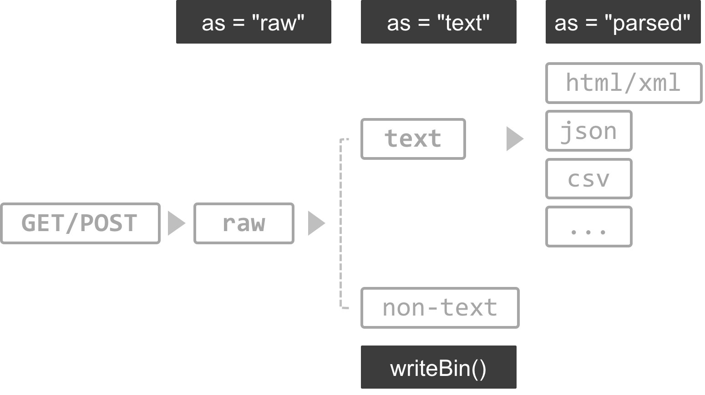

```{r, include=FALSE}
library(knitr)
knitr::opts_chunk$set(warning = TRUE,
                      echo = TRUE,
                      message = TRUE,
                      collapse = FALSE,
                      comment = "#>",
                      fig.align='center',
                      cache=FALSE)
# knitr::opts_knit$set(root.dir = '.')
```

# <br/><br/>RCrawler101-201605 (Week2) {.white}


<p class="white">
`r Sys.Date()`<br/>
<p style='color:white'>
  [Leo Lu](https://tw.linkedin.com/in/leoluyi)
</p>
</p>


---

## Slides<br/>http://bit.ly/RC101-201605-W2<br/>http://bit.ly/安裝R {.shout .shrink}

---


# How to use this slides

- Press **Esc** to navigation mode
- Press **pageDown**, **Right** or **Down** to go to next slide
- Presss **PageUP**, **Left** or **Up** to go to previous slide

## Download this slides
[here](http://leoluyi.github.io/RCrawler101_201605_Week2/)
(Right Click > Save As...)

#  

<div align="center" style="font-size: 250%">
<p>課程資訊</p>
<a target="_blank" href="http://data-sci.info/r-crawler-101/">網站</a>/
<a target="_blank" href="http://data-sci.info/forums/">論壇</a>/
<a target="_blank" href="https://www.facebook.com/datasci.info">粉絲頁</a>/
<a target="_blank" href="https://goo.gl/rt7uAJ">廣播</a>/
<a target="_blank" href="https://goo.gl/ennxQz">共筆</a>
</div>

<div align="center">
<h3>
課後若有任何問題歡迎至論壇發問
</h3>
</div>


# 關於教材授權

## 本教材之智慧財產權，屬木刻思股份有限公司所有

如果有朋友，覺得此教材很棒，希望能分享給朋
友，或是拿此教材開課。非常歡迎大家來信至
course@agilearning.io 請求教材的使用授權唷！

This material is modified from [Mansunkuo](https://github.com/mansunkuo)'s work.  
All rights reserved by Agilearning.

# Outline

+ Recap for observation skills (10 min)
+ R Basic (quick recap) and RStudio IDE (10 min)
+ Connection (40 min)
    - Crawler’s toolkits in R
    - GET
    - POST
+ Parsing Data (60 min)
    + XPath & CSS
    + json
    + xml
    + html table
    + Reular Expression
+ Save your data (10 min)
+ Case study
+ References


# Install: Chrome Extension

+ [EditThisCookie](https://chrome.google.com/webstore/detail/editthiscookie/fngmhnnpilhplaeedifhccceomclgfbg?hl=zh-TW)
+ [XPath Helper](https://chrome.google.com/webstore/detail/xpath-helper/hgimnogjllphhhkhlmebbmlgjoejdpjl?hl=zh-TW)
+ [JSON Viewer](https://chrome.google.com/webstore/detail/json-viewer/gbmdgpbipfallnflgajpaliibnhdgobh)
+ [Advanced REST client](https://chrome.google.com/webstore/detail/advanced-rest-client/hgmloofddffdnphfgcellkdfbfbjeloo?utm_source=chrome-ntp-icon)

---

## Architecture of Crawlers


# Recap: Observation Skills and HTTP Request for Connection

+ URL, Method, GET, POST, Headers, Body
+ Exercise: [PTT Gossiping](https://www.ptt.cc/bbs/Gossiping/)
請練習找到文章列表資料的連線

# R Packages Required

## Pipeline Coding
- [magrittr](https://github.com/smbache/magrittr)

## Crawler's toolkits in R
- [rvest](https://cran.r-project.org/web/packages/rvest/index.html): a web scraper based on httr and xml2
- [httr](https://cran.r-project.org/web/packages/httr/index.html): toolkit of  [HTTP methods](http://www.w3schools.com/tags/ref_httpmethods.asp) in R
- [XML](https://cran.r-project.org/web/packages/XML/index.html) & : XML parser
- [xml2](https://cran.r-project.org/web/packages/xml2/index.html): xml parser based on libxml2

## misc
- [stringr](): string manipulaiton
- [data.table](https://github.com/Rdatatable/data.table): extension of data.frame, a powerful ETL tool in R


# Install Packages

## (if you haven't installed those packages yet)

There are system dependency when [installing devtools](https://www.rstudio.com/products/rpackages/devtools/)

[Installation guide](install_R.html) from R basic class

```{r, eval=FALSE}
## === install required packages ===
pkg_list <- c("magrittr", "httr", "rvest", "stringr", "data.table",
              "jsonlite", "RSQLite", "devtools")
pkg_new <- pkg_list[!(pkg_list %in% installed.packages()[,"Package"])]
if(length(pkg_new)) install.packages(pkg_new)
if("xmlview" %in% pkg_new) {devtools::install_github("hrbrmstr/xmlview")}
if("data.table" %in% pkg_new) {
    install.packages("data.table", type = "source",
                      repos = "https://Rdatatable.github.io/data.table")
} else if (packageDescription("data.table")$Version < "1.9.7") {
    install.packages("data.table", type = "source",
                      repos = "https://Rdatatable.github.io/data.table")
}
rm(pkg_new, pkg_list)
```

---

## Let's Rock with R! { .shout .shrink }

---

# Hello RStudio


# RStudio Settings


</p>

# Must-known keyboard shortcuts

[All RStudio keyboard shortcuts](https://support.rstudio.com/hc/en-us/articles/200711853-Keyboard-Shortcuts)

<div style="font-size: 80%">
| Description      |  Windows & Linux      |     Mac                 |
|------------------|:---------------------:|:-----------------------:|
| Attempt completion / Indent | <kbd>Tab</kbd>     | <kbd>Tab</kbd>  |
| Run current line/selection  | <kbd>Ctrl</kbd>+<kbd>Enter</kbd> | <kbd>⌘</kbd>+<kbd>↩︎</kbd> |
| Comment/uncomment current line/selection | <kbd>Ctrl</kbd>+<kbd>Shift</kbd>+<kbd>C</kbd> | <kbd>⌘</kbd>+<kbd>⇧</kbd>+<kbd>C</kbd> |
| Reindent lines              | <kbd>Ctrl</kbd>+<kbd>I</kbd> | <kbd>⌘</kbd>+<kbd>I</kbd> |
| Insert pipe operator | <kbd>Ctrl</kbd>+<kbd>Shift</kbd>+<kbd>M</kbd> | <kbd>⌘</kbd>+<kbd>⇧</kbd>+<kbd>M</kbd>
</div>


# R recap

- How to get help
- Working Environment
- Basic Data Structure
- Function
- if/else, for, tryCatch
- [magrittr](https://github.com/smbache/magrittr)
- [data.table](https://cran.r-project.org/web/packages/data.table/index.html)


# How to get help

- `?`: Access document in R console
- `??`: Search the help system
- google with appropriate keyword. For example:
    - R {package name}
    - R {algorithm name}
- Forum
    - [Stack Overflow](http://stackoverflow.com/questions/tagged/r)  
      A question and answer site for programmers
    - [Taiwan R user Group](http://www.meetup.com/Taiwan-R/)  
      A free R/data analysis user group in Taiwan
    - [PTT R_Language board](https://www.ptt.cc/bbs/R_Language/index.html)  
      A bbs forum for R in Taiwan


# Working Environment

## Check your working directory everytime you start to work!

Using `getwd`/`setwd` to get/set your working directory.

## RStudio will set working directory automatically when opening new files

If you [use Projects](https://support.rstudio.com/hc/en-us/articles/200526207-Using-Projects),
RStudio will change working directory for you automatically.


# Basic Data Structure

`Vector`, `Matrix`, `Array`, `List` and `Data frame` are the most basic data structure in R.
These data structures can be mapped into a table according to:

- dimension
- Homogeneous or Heterogeneous of data type


|      | Homogeneous         | Heterogeneous  |
| ---- | ------------------  |--------------- |
| 1d   | ___Atomic vector___ | ___List___     |
| 2d   | Matrix              | Data frame     |
| nd   | Array               |              	|


# (Atomic) Vector

- (Atomic) vector is a basic data structure in R. 
- They are linear vectors of a single primitive type. A scalar is a vector of length 1.


```{r, collapse=TRUE}
v1 <- c(1:10)
v1
is.vector(v1)
length(v1)
s1 <- 2
s1
is.vector(s1)
length(s1)
```

# List

Lists are also vectors, but not ___atomic vectors___. Lists are ___generic vectors___, with (naturally) different semantics.

Elements in a list can be any kinds type and its length is arbitrary.

> Function `str` can help you investigate the structure of a nested list.


```{r}
li <- list(a = 1:10, 
           b = c("apple", "banana"))
str(li)
```


```{r}
li2 <- list(li = li, 
            c = matrix(1:4, nrow = 2))
str(li2)
```

# Visualising lists

```{r}
x1 <- list(c(1, 2), c(3, 4))
x2 <- list(list(1, 2), list(3, 4))
x3 <- list(1, list(2, list(3)))
```


# Lists Subsetting


```{r}
a <- list(a = 1:3, b = "a string", c = pi, d = list(-1, -5))
```

- `[` extracts a sub-list. The result will always be a list.
```{r, eval=FALSE}
str(a[1:2])
str(a[4])
```

- `[[` extracts a single component from a list. It removes a level of hierarchy from the list.
```{r, eval=FALSE}
y <- list("a", 1L, 1.5, TRUE)
str(y[[1]])
str(y[[4]])
```

- `$` is a shorthand for extracting named elements of a list. It works similarly to `[[` except that you don’t need to use quotes.
```{r, eval=FALSE}
a$a
a[["b"]]
```

# Lists Subsetting (Pepper Shaker)


# Data Frame

Data frame is a 2-dimension data structure to deal with a table-like heterogeneous data.

```{r}
df <- data.frame(gender = c("male", "female", "female", "male"),
                 age = c(33, 18, 24, 26))
## Add new column in a data frame
df$city <- c("Taipei", "Taipei", "Hsinchu", "Taichung")
```

```{r}
df
str(df)
```


# Recap: data structure

All data structures above are objects.
They apply different methods and saved as different type internally.

```{r echo = FALSE}
x <- data.frame(object = c('c(1, 2.5, 3)', 
                           'c("male", "female", "female", "male")',
                           'factor(c("male", "female", "female", "male"))', 
                           'matrix(1:9, nrow = 3)',
                           'list(a = 1:10, b = c("apple", "banana"))',
                           'data.frame(a = 1, b = "z")'))
x$type <- sapply(parse(text = sprintf("typeof(%s)", x$object)), eval)
x$class <- sapply(parse(text = sprintf("class(%s)", x$object)), eval)
knitr::kable(x)
```


# Function 

To understand computations in R, two slogans are helpful:  

> + Everything that exists is an object.  
> + Everything that happens is a function call.  
> 
> **John Chambers**

<br/>

```{r, collapse=TRUE}
`+`
`<-`
`[`
`c`
```


# Function in R

A typical function in R may look like:

```{r}
f <- function(par1, par2, ...) {
    # Some magic happened
    return(sth)    # return something
}
```

- If you don't use `return` to specify the return value, 
  the return value will be the _last expression_ inside the function.
- Call by value by default  
    send a copy of a object into a function and the input object won't change after execution without assignment

# Control Flow {.shout}

# If

The basic structure of conditional execution in R is:

```{r, eval=FALSE}
if (an expression returns TRUE or FALSE) {
    # do something
} else if (another expression returns TRUE or FALSE) {
    # do something
} else {
    # do something
}
```


# for

Iterate items in R.

```{r}
# iterate a character vector
for (i in c("a", "b")) {
    print(i)
}

# nested loop
m <- matrix(numeric(), nrow = 2, ncol = 2)
for (i in 1:nrow(m)) {
    for (j in 1:ncol(m)) {
        m[i, j] <- i * j
    }
}
m
```


# tryCatch

- tryCatch let you deal with error handling in R.
- Error handling is __IMPORTANT__ when wrapping your crawler into a function because you don't want your function fail without any outcome.

```{r, eval=FALSE}
tryCatch({
  result <- expr
  # If you want to use more than one 
  # R expression in the "try" part then you'll have to 
  # use curly brackets.
  # 'tryCatch()' will return the last evaluated expression 
  # in case the "try" part was completed successfully
}, warning = function(w) {
  message("Here's the original warning message:")
  message(w)
  # Choose a return value in case of warning
  return(NULL)
}, error = function(e) {
  message("Here's the original error message:")
  message(e)
  # Choose a return value in case of error
  return(NA)
}, finally {
  message("Some other message at the end")
  # finally:
  # Here goes everything that should be executed at the end,
  # regardless of success or error.
  # Usually it's used for releasing resources.
  # If you want more than one expression to be executed, then you 
  # need to wrap them in curly brackets ({...}); otherwise you could
  # just have written 'finally=<expression>' 
})
```

https://stackoverflow.com/questions/12193779/how-to-write-trycatch-in-r/12195574#12195574

# magrittr


# What is magrittr


1. (LHS) will be piped in as the ___first argument___ of the function on the (RHS) with `%>%`.
2. Use the dot, `.`, as placeholder in a expression.

- `x %>% f` is equivalent to `f(x)`
- `x %>% f(y)` is equivalent to `f(x, y)`
- `x %>% f %>% g %>% h` is equivalent to `h(g(f(x)))`
- `x %>% f(y, .)` is equivalent to `f(y, x)`
- `x %>% f(y, z = .)` is equivalent to `f(y, z = x)`

<br/>

## Example
```{r, eval=FALSE}
library(magrittr)
iris %>% head(5)
```

- Using the dot place-holder
```{r, eval=FALSE}
mtcars %>%
  subset(hp > 100) %>% 
  .[c("mpg", "cyl", "hp")]
```

---

## Workflow of Crawler Design {.shout}

---


## Architecture of Crawlers


# Workflow

1. 找到資料頁，想像資料要長什麼樣子，設想產出的資料格式(schema)
2. 觀察網頁內容，找到資料所在的request/response，再一層層往上解析，套上判斷式及迴圈, 完成爬蟲的自動化。
3. 解析取得的資料。


# Crawler's toolkits in R

- [rvest](https://cran.r-project.org/web/packages/rvest/index.html): a web scraper based on httr and xml2
- [httr](https://cran.r-project.org/web/packages/httr/index.html): toolkit of  [HTTP methods](http://www.w3schools.com/tags/ref_httpmethods.asp) in R
- [XML](https://cran.r-project.org/web/packages/XML/index.html) & : XML parser
- [xml2](https://cran.r-project.org/web/packages/xml2/index.html): xml parser based on libxml2
- [RCurl](https://cran.r-project.org/web/packages/RCurl/index.html): a wrapper of libcurl

---

# <br/><br/>Web Connector in R {.white}


---

# HTTP request

A valid HTTP request includes four things:

- **URL**: a unique address for a thing
- **Method**:
    - GET: to retrive a resource
    - POST: to create a new resource
- **Headers**: Meta-information about a request
    - User-Agent
    - Cookie
    - Content-type
    - [List of HTTP header fields](https://en.wikipedia.org/wiki/List_of_HTTP_header_fields)
- **Body**: data to be send to a server


# Web Connector in R
- `{httr}`
- `{RCurl}`
- `download.file()`
- Socket Connection Tools:
    - socketConnection
    - `make.socket` / `read.socket` / `close.socket`


# httr

- Basic Features:
    - HTTP verbs: `GET()`, `POST()`, `HEAD()`... 
    - `http_status`: Translate http status code
       [HTTP status](https://zh.wikipedia.org/wiki/HTTP%E7%8A%B6%E6%80%81%E7%A0%81) code
    - `status_code`
    - `set_cookies()`: set cookles
    - `add_headers()`: add additional headers to a request.
    - `headers()`: Access response headers
    - `content()`: Retrieve the contents of a request
        - as = "parsed": detect content type automatically and parse the result
        - as = "text": return character
        - as = "raw": return binary


# Connection: GET Method

Use `GET()` to request data from a specific resource

## 起手式

```{r, eval=FALSE}
## Not Run
library(httr)
res <- GET(
  url = "http://httpbin.org/get",
  add_headers(a = 1, b = 2),
  set_cookies(c = 1, d = 2),
  query = list(q="hihi")
)
content(res, as = "text", encoding = "UTF-8")
content(res, as = "parsed", encoding = "UTF-8")
```


# 一個例子學會第一隻爬蟲

- PTT Gossiping

<a href="https://www.ptt.cc/bbs/Gossiping/index.html" target="_blank">

</a>


```{r, collapse=TRUE}
library(magrittr)
library(httr)
library(rvest)

## Connection
url <- "https://www.ptt.cc/bbs/Gossiping/index.html"
res <- GET(url, 
           set_cookies(over18="1"))  # over18 cookie

## (Try get post titles)
res %>% 
  content(as = "text", encoding = "UTF-8") %>% 
  `Encoding<-`("UTF-8") %>% 
  read_html %>% 
  html_nodes(css = ".title a") %>% 
  html_text()
```


# Cookies

- A small piece of data sent from a website and stored in the user's web browser while the user is browsing it
- Sometimes you may need set cookies with `set_cookies` to retreve a request.

```{r, eval=FALSE}
set_cookies(a = 1, b = 2)
set_cookies(.cookies = c(a = "1", b = "2"))
```

- Example
```{r, collapse=TRUE, eval=FALSE}
library(httr)
url <- "https://www.ptt.cc/bbs/Gossiping/index.html"
res <- GET(url, 
           set_cookies('over18'='1'))  # over18 cookie
```

# The response status code

```{r, collapse=TRUE}
url <- "https://www.ptt.cc/bbs/Gossiping/index.html"
res <- GET(url, 
           set_cookies('over18'='1'))  # over18 cookie

# Get an informative description:
http_status(res)

# Or just access the raw code:
res$status_code
status_code(res)

# highly recommend using one of these functions whenever you're using httr inside a function to make sure you find out about errors as soon as possible.
warn_for_status(res)
stop_for_status(res)
```


# Set header

Sometimes you may need to provide appropriate 
[HTTP header fields](https://en.wikipedia.org/wiki/List_of_HTTP_header_fields)
with `add_headers()` to make a request.

```{r, eval=FALSE}
## Not run
add_headers(a = 1, b = 2)
add_headers(.headers = c(a = "1", b = "2"))
```

- [Starbucks](resources/example/starbucks.html)

<a href="http://www.starbucks.com.tw/stores/storesearch.jspx">

</a>

# Connection: POST method

- Submits data to be processed to a specified resource
- The query string (name/value pairs) is sent in the HTTP message body

## 起手式

```{r, eval=FALSE}
## Not Run
library(httr)
library(rvest)

res <- POST(url = "http://httpbin.org/post",
            add_headers(a = 1, b = 2),
            set_cookies(c = 1, d = 2),
            body = "x=hello&y=hihi")  # raw string (need URLencode)

res <- POST(url = "http://httpbin.org/post",
            add_headers(a = 1, b = 2),
            set_cookies(c = 1, d = 2),
            body = list(x = "hello", 
                        y = "hihi"), # form data as list
            encode = "form")

content(res, as = "text", encoding = "UTF-8")
content(res, as = "parsed", encoding = "UTF-8")
```


# 一個例子學會第二隻爬蟲: Guestbook

[Guestbook](resources/example/guestbook.html)


# Exercise: Guestbook

Try to post a message in 
[App Engine GuestBook](http://apt-bonbon-93413.appspot.com/)

---

## 10-min break { .shout .shrink }

---

# Let's see what we got in the<br/>response body {.shout}

# The Response Body

3 ways to access the body of the request with `httr::content()`:

<div align="center">

</div>

# The Response Body

## `httr::content()`

```{r}
res <- GET("https://www.ptt.cc/bbs/NBA/M.1463302851.A.8D7.html")
```


+ __binary__
```{r}
(bin <- content(res, as = "raw")) %>% head(200) # raw (binary) vector
# writeBin(bin, "myfile.txt") # the highest fidelity way of saving files to disk
```

+ __text__
```{r}
content(res, as = "text", encoding = "UTF-8") %>%  # accesses the body as a character vector
  `Encoding<-`("UTF-8")
```

+ __auto parsed__
httr provides a number of default parsers for common file types:  
html_document, csv, json, jpeg, png. See `?httr::content`
```{r}
content(res, as = "parsed")
```


# Beware of System Encoding

- Parse data with appropriate encoding
- Use `Encoding()`, `iconv()` and `Sys.setlocale()` in Windows (non-UTF8 system).
- `iconvlist()` to show all encodings availabe.

# Encoding

`?locales`
`?Encoding`
`?iconv`
`iconvlist()`

- Unix-like
```{r, eval=FALSE}
## check out your system locale
Sys.getlocale()
#> [1] "en_US.UTF-8/en_US.UTF-8/en_US.UTF-8/C/en_US.UTF-8/en_US.UTF-8"
aa <- "你好嗎"
Encoding(aa)
#> [1] "UTF-8"
charToRaw(aa)
#> [1] e4 bd a0 e5 a5 bd e5 97 8e

(aa_big5 <- iconv(aa, from = "UTF-8", to = "Big5"))
#> [1] "\xa7A\xa6n\xb6\xdc"
Encoding(aa_big5)
#> [1] "unknown"
harToRaw(aa_big5)
#> [1] a7 41 a6 6e b6 dc
```

- Windows
```{r, eval=FALSE}
# On Windows
Sys.getlocale()
#> "CP950"
aa <- "你好嗎"
Encoding(aa)
#> "unknown"
aa_utf8 <- iconv(aa, from = "Big5", to = "UTF-8")
Encoding(aa_utf8)
#> "UTF-8"
```


---

# The secret of URL

```
URL?par1=val1&par2=val2
```

- The query string is sent in the URL of a
[GET](http://www.w3schools.com/tags/ref_httpmethods.asp) request
- Non-ASCII character and some preserved characters need to be encoded with 
[URL Encode](http://www.w3schools.com/tags/ref_urlencode.asp)
- In most situation, you may need to manipulate the query string when you 
write a crawler


# Query String

You can assign query parameter with `query()` 

- Example: http://ecshweb.pchome.com.tw/search/v3.3/?q=sony
```{r}
res1 <- GET(
  "http://ecshweb.pchome.com.tw/search/v3.3/all/results?q=sony&page=1&sort=rnk/dc"
)

res2 <- GET("http://ecshweb.pchome.com.tw/search/v3.3/all/results",
            query = list(q="sony", page="1", sort="rnk/dc"))
```


# Concatenate strings / String formatting

```{r}
q_string = "apple"
paste0("hihi", q_string)
paste0("hihi", q_string, 1:3)  # recycling to length 3
paste("hihi", q_string, 1:3, sep = " ", collapse = ",")
sprintf("%s, %s", "hihi", q_string) # often use this to constuct a url
```


# Url Encoding in R

```{r}
URLencode(" ")  # a space
q_string = "蘋果電腦"
(q_string_enc = URLencode(q_string))
URLdecode(q_string_enc)
```


<!-- # Use string template -->

<!-- ```{r} -->
<!-- library(whisker) -->

<!-- url_template = paste0("http://ecshweb.pchome.com.tw/search/v3.3/all/results?", -->
<!--                       "q={{q}}&page={{page}}&sort={{sort}}", collapse = "") -->
<!-- url3 = whisker.render(url_template, list(q="sony", page="1", sort="rnk/dc")) -->
<!-- url3 -->
<!-- res3 = GET(url3) -->
<!-- identical(res$content, res3$content) -->
<!-- ``` -->


---

# <br/><br/>Parsing Data {.white}


---

# Response Content

<div align="center">

</div>

# What to Parse

## Structured data
+ __html elements__: (`rvest::html_node`)
+ __json, jsonp__: PChome, 紫外線即時監測資料 (`jsonlite::fromJSON`)
+ __html table__: 公開資訊觀測站 (`rvest::html_table`, `XML::readHtmlTable`)
+ __xml table__: 7-11 (`XML::xmlToDataFrame`)

## Unstructured data
+ __RegEx__: 東森房屋的地址


# Parsing Response Content: Text Type

<div align="center">

</div>


# rvest

A web scraper designed to work with magrittr.

- Create a html document with `read_html()`
- Select parts of a document using css selectors or xpath
    - `html_nodes(doc, css = "<css selector>")`
    - `html_nodes(doc, xpath = "<css selector>")`
- Extract components with 
    - `html_name()`: the name of the tag
    - `html_text()`: all text inside the tag
    - `html_attr()`: contents of a single attribute
    - `html_attrs()`: all attributes
    - `html_table`: parse tables into data frames 


# Use with rvest

- 起手式
```{r, eval=FALSE}
GET(url) %>% content(as="text") %>% rvest::read_html()
```

<br/>
<div align="center">

</div>

# Extract elements from HTML document {.shout}


# { .fullpage }


# Tree Structure of HTML

## (Document Object Model, DOM)

```{xml}
<a href = "www.meetup.com/Taiwan-R">
  Taiwan R User Group Website
</a>
```

- ___nodename___: `a`
- ___attribute___: `href` with value `"www.meetup.com/Taiwan-R"`
- ___text___: `Taiwan R User Group Website`


# A simple HTML document

<a target="_blank" href="http://leoluyi.github.io/RCrawler101_201605_Week2/resources/data/demo.html">demo_page<a>

```{r, collapse=TRUE}
library(magrittr)
doc = readLines("http://leoluyi.github.io/RCrawler101_201605_Week2/resources/data/demo.html", encoding = "UTF-8") %>%
    paste(collapse = "\n")
cat(doc)
```


# Create HTML document object

<div align="center">

</div>

```{r}
library(rvest)
doc <- GET("http://leoluyi.github.io/RCrawler101_201605_Week2/resources/data/demo.html") %>% 
  content(as = "text", encoding = "UTF-8") %>% 
  read_html()
doc
class(doc)
```

---

# Extract with CSS selector

CSS practice: http://flukeout.github.io/


```{r}
doc <- read_html("http://leoluyi.github.io/RCrawler101_201605_Week2/resources/data/demo.html")
doc %>% 
  html_nodes(css = ".character") %>% # a node set
  as.character()
doc %>% 
  html_nodes(css = "#title > .link") %>% 
  as.character()
```


# html_node() vs html_nodes()

- `html_node()`, like `[[`, always exactly one element in each node of a nodeset.
- `html_nodes()` collapses output of all matched nodes. (We usually use this)

# Extract with XPath

```{r}
doc <- read_html("http://leoluyi.github.io/RCrawler101_201605_Week2/resources/data/demo.html")
doc %>% 
  html_nodes(xpath = "//*[@class='character']") %>% 
  as.character()
  
doc %>% 
  html_nodes(xpath = "//div[@id='title']/a") %>% 
  as.character()
```

# Extract text
```{r}
doc %>% 
  html_nodes(xpath = "//*[@class='character']") %>% 
  html_text()
  
doc %>% 
  html_nodes(xpath = "//div[@id='title']/a") %>% 
  html_text()
```

# Extract name of tag

```{r}
node = doc %>% 
    html_nodes(css = "#summary") %>% 
    html_name
node
```


# Extract link

```{r}
link = doc %>% 
    html_nodes(xpath = "/html/body/div[@id='title']/a") %>%
    html_attr("href")
link
```

# Exercise: 抓PTT推文

https://www.ptt.cc/bbs/Gossiping/M.1464355692.A.0E5.html

<br/>
## 10-min break


---

# Example: PTT

use package `xmlview` to parse XML content and extract elements.

- [PTT](resources/example/ptt_xmlview.html)


# Extract Table Using rvest::html_table()

(html_table() is temperarily not working with non-ascii data on Windows.)
<a target="_blank" href="http://leoluyi.github.io/RCrawler101_201605_Week2/resources/data/demo.html">demo_page</a>

- `html_table()` extracts table(s) as a _list_.
```{r}
students <- read_html("http://leoluyi.github.io/RCrawler101_201605_Week2/resources/data/demo.html") %>% 
    # html_nodes(css = "#table1>table") %>%  # also can select table first
    html_table()
students
```

# Extract Table Using XML::readHTMLTable()

<a target="_blank" href="http://leoluyi.github.io/RCrawler101_201605_Week2/resources/data/demo.html">demo_page</a>

- `readHTMLTable()` extracts table(s) as a _list_.
```{r}
res_text <- GET("http://leoluyi.github.io/RCrawler101_201605_Week2/resources/data/demo.html") %>% 
  content("text", encoding = "UTF-8") %>% 
  `Encoding<-`("UTF-8")

# read and extract tables from html string
tables <- res_text %>% XML::readHTMLTable(encoding = "UTF-8")
```

```{r, eval=FALSE}
str(tables) # take a look 
View(tables[[2]]) # take a look 
```


- Result
```{r}
tables[[2]]
```

# Example: Yahoo Stock
- [Yahoo Stock](resources/example/yahoo_stock.html)

# Example: 公開資訊觀測站
- [公開資訊觀測站](resources/example/mops.html)


# Parse XML table

Parse XML table with `XML::xmlToDataFrame()`

## Example
- [Seven Eleven](resources/example/seven_eleven.html)
- RegEx: 7-11 citycode (areacode.js)


# Parse JSON format

Yun can parse 
[JSON](http://www.w3schools.com/json/)
with `jsonlite` in R

<br/>
<div align="center">

</div>

# Parse JSON with jsonlite

- Example: PChome API
```{r}
library(jsonlite)
library(magrittr)
res <- GET("http://ecshweb.pchome.com.tw/search/v3.3/all/results?q=sony&page=1&sort=rnk/dc")
```

- `jsonlite::fromJSON()`
```{r}
res_df <- content(res, as = "text", encoding = "UTF-8") %>% 
  `Encoding<-`("UTF-8") %>% 
  fromJSON() %>%
  .$prods  # equivelent to (function(x) {x$prods})
```
```{r, collapse=TRUE}
head(res_df)
```


# `httr` auto parse json as list

```{r}
res_list <- content(res, as = "parsed")
# str(res_list)
res_list$prods[[1]]
```


# Combind list of dataframes with loop

```{r}
# str(res_list$prods)
res_df2 = data.frame()
for (i in 1:length(res_list$prods)) {
  res_df2 = rbind(res_df2, 
                  data.frame(res_list$prods[[i]], 
                             stringsAsFactors = FALSE))
}
identical(res_df, res_df2)
```

(better use `do.call` + `rbind`)

# More general way to combine list of dataframes

- `do.call` + `rbind`
- `data.table::rbindlist`


# Parse Parse list of dataframes with

## `do.call` + `rbind`

```{r, collapse=TRUE}
## first make a list of dataframes
df_list <- lapply(res_list$prods, as.data.frame, stringsAsFactors = FALSE)
# head(res_list$prods, 3) %>% str
# head(df_list, 3) %>% str
```

```{r}
# combine dataframes
res_df3 = do.call(rbind, df_list)
identical(res_df, res_df3)

# str(res_df3)
```

## `data.table::rbindlist`

```{r}
library(data.table)
res_df4 = rbindlist(df_list)
head(res_df4)
```

---

# Exercise: UV API (JSON)

[行政院環境保護署環境資源資料開放平台](http://opendata.epa.gov.tw/DevelopZone/Sample/UV/)提供了一系列的RESTful Api供大家取用，請試著把
[紫外線即時監測資料](http://opendata.epa.gov.tw/webapi/api/rest/datastore/355000000I-000004/?format=json)的資料取回來並轉成data.frame


# Answer

[紫外線即時監測資料](resources/example/uv.html)


---

# Unstructured data


# 非結構化資料解析: Regular Expression

## Package `stringr`

```{r}
library(stringr)
fruits <- c("one apple", "two pears", "three bananas")
str_replace(fruits, "[aeiou]", "-")
str_replace_all(fruits, "[aeiou]", "-")

shopping_list <- c("apples x4", "bag of flour", "bag of sugar", "milk x2")
str_extract(shopping_list, "[a-z]+")
str_extract_all(shopping_list, "[a-z]+")
```

# Exercise : ETwarm

- [東森房屋](resources/example/etwarm.html)
- 試著找到「新北市」的資料


---

# <br/><br/>Save your data {.white}


---


# Save your data

- `write.csv`: write data.frame as csv file
- `download.file`: save html, jpeg, etc
- `writeBin`: write binary object into disk
- `RSQLite`: SQLite connector in R

## Working Environment

__Check your working directory everytime you start to work!__

```{r working_dir2, eval=FALSE}
## Not run
getwd() # current config
setwd("/xxx/xxxxx") # set working directory to "/xxx/xxxxx"
setwd("..")  # set working directory to up one directory
setwd("./xxxx")  # relative path to current directory
```

# write.csv() / data.table::fwrite()

```{r, eval=FALSE}
library(jsonlite)
library(httr)
url = "http://ecshweb.pchome.com.tw/search/v3.3/all/results?q=sony&page=1&sort=rnk/dc"
res_df = GET(url) %>% 
    content(res, as = "text") %>% 
    fromJSON() %>% 
    .$prods     # equivelent to (function(x) {x$prods})
write.csv(res_df, "pchome.csv", row.names = FALSE)

library(data.table) # >= 1.9.7
fwrite(res_df, "pchome.csv")  # very fast!
```


# download.file()

To download a file from the Internet.
download.file takes advantage of internet utilities such as
curl or wget and may fail if you don't 
have any of these utilities in your system.

```{r, eval=FALSE}
dest_dir = "resources/data/download"
dir.create(dest_dir, showWarnings = FALSE, recursive = TRUE)

# Download whole HTML file
download.file("https://www.r-project.org/", 
              file.path(dest_dir, "r-project.org.html"))

# Download image
download.file("https://www.r-project.org/Rlogo.png",
              file.path(dest_dir, "Rlogo.png"))

list.files(dest_dir)
```


# writeBin()

To write binary data to your local disk.

```{r, eval=FALSE}
dest_dir = "resources/data/download"

r = GET("http://opendata.epa.gov.tw/webapi/api/rest/datastore/355000000I-000004/?format=json")
# Set as = "raw" to prevent any character encoding
bin = content(r, as = "raw")
writeBin(bin, file.path(dest_dir, "uv.json"))
```


# Database

- RSQLite: A light-weight database engine interface in R   
    - [PChome Example](resources/example/pchome.html)
- Other relational database connector in R
    - [RODBC](https://cran.r-project.org/web/packages/RODBC/index.html)
    - [RJDBC](https://cran.r-project.org/web/packages/RJDBC/index.html)
    - [RMySQL](https://cran.r-project.org/web/packages/RMySQL/index.html)
    - ...


# Case study

- [東森房屋](resources/example/etwarm.html)
- [Guestbook](resources/example/guestbook.html)
- [Yahoo Stock](resources/example/yahoo_stock.html)
- [紫外線即時監測資料](resources/example/uv.html)
- [PTT Gossiping](resources/example/ptt_gossiping.html)
- [PTT 推文](resources/example/ptt_xmlview.html)
- [Starbucks](resources/example/starbucks.html)
- [Seven Eleven](resources/example/seven_eleven.html)
- [FamilyMart](resources/example/family_mart.html) # json & referer
- [PChome](resources/example/pchome.html)
- [公開資訊觀測站](resources/example/mops.html)
- [中央氣象局觀測資料查詢系統](resources/example/cwb.html)


# References

- [rvest](https://github.com/hadley/rvest)
- [httr](https://cran.r-project.org/web/packages/httr/index.html)
- [HTTP Methods](http://www.w3schools.com/tags/ref_httpmethods.asp)
- [An Introduction to APIs](https://zapier.com/learn/apis/)
- [Advanced R](http://adv-r.had.co.nz/)
- [data.table](https://github.com/Rdatatable/data.table)
- [RSQLite](https://cran.r-project.org/web/packages/RSQLite/index.html)


# 第二週課程課後問卷

<div class="double">
恭喜大家完成第二周的學習，你已經相當會使用R來模仿瀏覽器行為，連線取得資料並解析了嘛？如果還不熟悉的同學可以把握周間的空檔複習，課程中的助教與Mentor非常願意解決大家的問題。

另外大家也可以描述問題Po在[論壇 forums](http://data-sci.info/groups/r-crawler-101/forum/)上面。
([論壇使用教學](https://www.youtube.com/watch?v=ut8hVwHFU28))

我們的目的，就是在大家學習上，提供更多面向的支持，順利完成學習目標，並且能持續學習成長。大家寶貴的意見都能立即提供給我們，以設計和調整出更完善臻至的課程與服務。


http://goo.gl/forms/pxKPMz6uiidkSsH52
</div>
